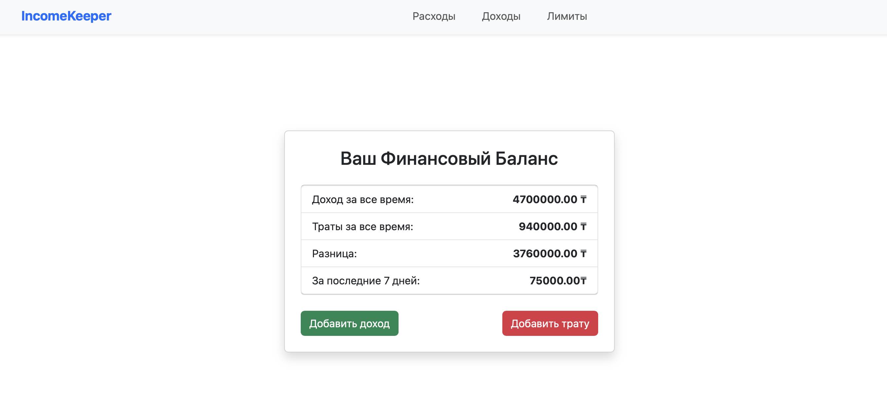
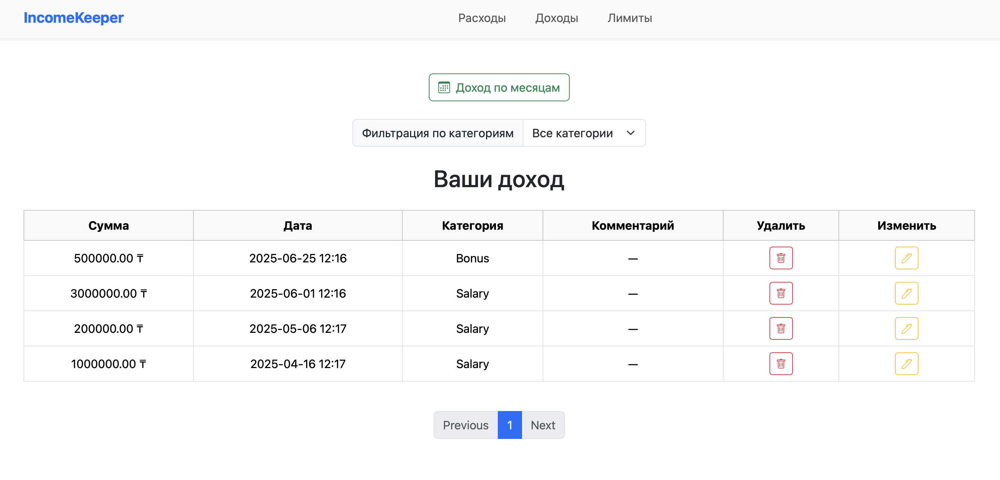
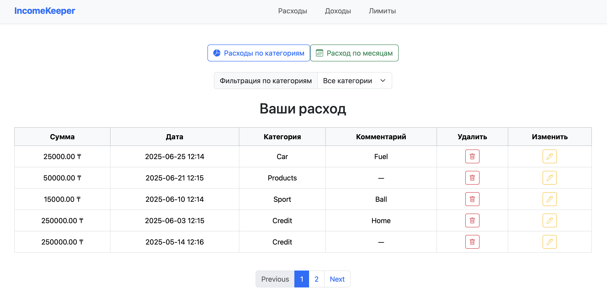
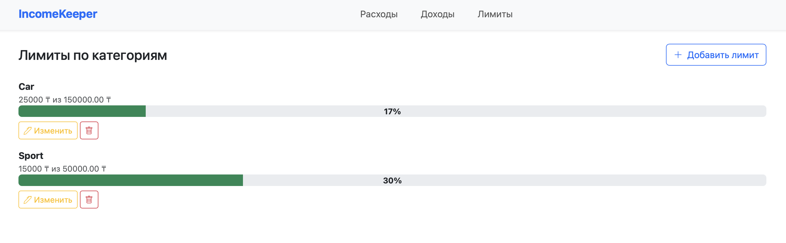
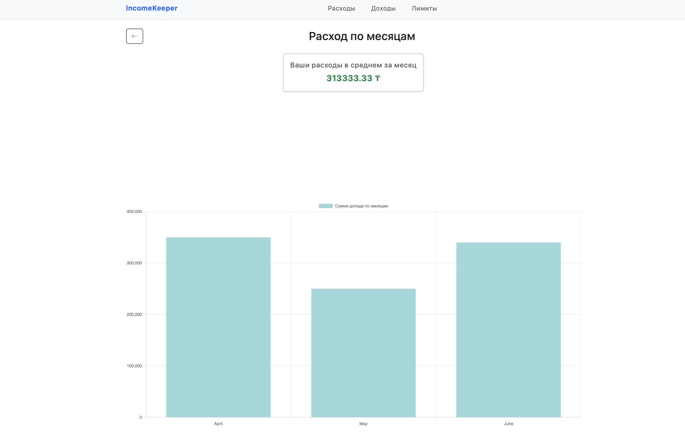
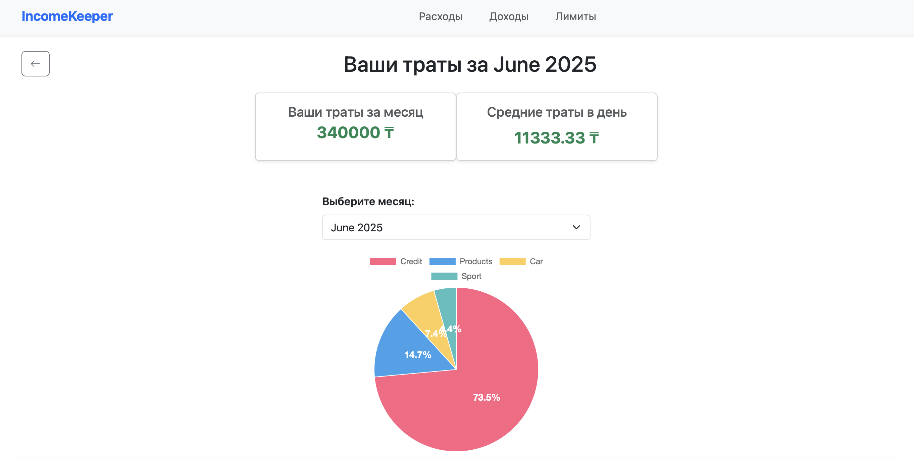

# Finance Tracker

Приложение для отслеживания доходов и расходов. Разработано на Django.

## Функции
- Добавление доходов и расходов
- Добавление Лимитов по категориям
- Авторизация пользователей (Еще не доделана, нету регистрации)
- Фильтрация по категориям
- Графики доходов и расходов (PieChart, BarChart)

## Скриншоты

Проект создан в учебных целях. Вы можете использовать и изменять код по своему усмотрению.

Установка проекта
1. Клонируйте репозиторий
git clone https://github.com/your-username/название-проекта.git
cd название-проекта

2. Создайте и активируйте виртуальное окружение
python3 -m venv venv
source venv/bin/activate # для Linux/Mac
venv\Scripts\activate # для Windows 

3. Установите зависимости
pip install -r requirements.txt

4. Выполните миграции базы данных
python manage.py migrate

5. Создайте суперпользователя для доступа к админке
python manage.py createsuperuser

6. Запустите сервер
python manage.py runserver #Если не запускается, попробуйте перейти в папку с manage.py 

Перейдите в браузере по адресу:
http://127.0.0.1:8000/ #Обычно дефолтный адрес

